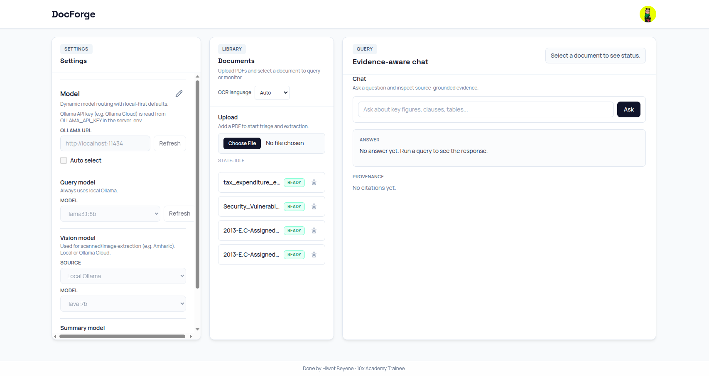

# DocForge — Document Intelligence Refinery

**Hiwot Beyene · 10x Academy Trainee · Week 3 Challenge**

Production-oriented, local-first document intelligence pipeline that turns PDFs and scanned documents into structured, queryable data with full provenance.

---

## Application Overview



DocForge is a five-stage agentic pipeline: **Triage → Structure Extraction → Semantic Chunking → PageIndex → Query**. The web UI (DocForge) lets you configure models, upload documents, and run evidence-aware chat over your corpus.

---

## Features

- **Triage-first extraction** — Each document is classified (origin type, layout complexity, language, domain). Extraction strategy (A → B → C) is chosen automatically with confidence-gated escalation.
- **Multi-strategy extraction** — **Strategy A** (Fast Text): pdfplumber/PyMuPDF for native digital, single-column. **Strategy B** (Layout): Docling or pdfplumber for table-heavy/multi-column. **Strategy C** (Vision): VLM or OCR for scanned/image-based docs (e.g. Amharic).
- **Full provenance** — Every answer cites document name, page number, and bounding box; extraction ledger records strategy, confidence, and cost per document.
- **PageIndex + vector + fact store** — Hierarchical section index, ChromaDB for semantic search, SQLite fact table for numeric/key-value queries.
- **Evidence-aware chat** — LangGraph agent with tools: pageindex navigation, semantic search, structured query. Responses include a provenance chain.
- **Dynamic model configuration** — Query model (local Ollama), vision model (Local or Ollama Cloud for e.g. Amharic), optional Ollama URL and API key. Settings panel in the UI.
- **Document library** — Upload PDFs, set OCR language (e.g. Amharic), process documents, and query or delete from the list. Status (IDLE / READY) and per-document actions.

---

## How to Use

1. **Start backend and frontend** (see Setup below). Open the app (e.g. http://localhost:3000).
2. **Configure models (Settings, left panel)**  
   - Set **Ollama URL** (e.g. `http://localhost:11434` for local; for Amharic/scanned with Cloud, set `OLLAMA_BASE_URL` and `OLLAMA_API_KEY` in backend `.env`).  
   - **Query model**: always local Ollama (e.g. `llama3.1:8b`).  
   - **Vision model**: Local Ollama or Ollama Cloud; used for scanned/image extraction (e.g. Amharic).  
   - Use **Refresh** to reload model lists.
3. **Upload and process (Library, center panel)**  
   - Choose **OCR language** (e.g. Amharic for scanned Amharic PDFs).  
   - Click **Choose File**, select a PDF, then upload.  
   - Click **Process** (or use the document action) to run triage and extraction. Wait until status is **READY**.
4. **Query (Query, right panel)**  
   - Select a document (e.g. via “Select a document to see status”).  
   - Type a question in the chat input (e.g. “What are the key figures?”) and click **Ask**.  
   - Read the answer and **Provenance** (citations). Use the cited page and bbox to verify in the source PDF.

**Amharic scanned documents:** Set OCR language to **Amharic** before processing. Ensure backend `.env` has `OLLAMA_BASE_URL=https://ollama.com` and `OLLAMA_API_KEY` for Cloud, or install `tesseract-ocr-amh` for local OCR fallback. See [Amharic scanned documents](#amharic-scanned-documents) below.

---

## Pipeline Graph

GitHub renders the diagram below when viewing this README. Linear flow: **Upload → Triage → Extract (A/B/C + escalation) → Chunk → Ingest (vector + facts + pageindex) → Query (retrieval + tools + synthesis)**.

```mermaid
flowchart TD
    %% =========================
    %% Stage 0: Ingestion
    %% =========================
    InputDocs["Stage 0: Input Corpus<br/>PDF native or scanned"]
    IngestNorm["Stage 0: Ingestion<br/>Upload to data/uploads + path record"]
    InputDocs --> IngestNorm

    %% =========================
    %% Stage 1: Triage Agent
    %% =========================
    Triage["Stage 1: Triage Agent Document Classifier<br/>origin_type, layout_complexity, language, domain_hint, estimated_extraction_cost"]
    ProfileStore[(".refinery/profiles/doc_id.json")]
    IngestNorm --> Triage
    Triage --> ProfileStore

    %% =========================
    %% Stage 2: Structure Extraction Layer
    %% =========================
    Router["Stage 2: Extraction Router<br/>Select initial strategy from profile"]
    Triage --> Router

    A["Strategy A: FastTextExtractor<br/>pdfplumber / PyMuPDF Low Cost"]
    AConf["A Confidence Gate<br/>tau_ab = 0.45"]
    B["Strategy B: LayoutExtractor<br/>Docling or pdfplumber fallback Medium Cost"]
    BConf["B Confidence Gate<br/>tau_bc = 0.40"]
    CBudget["Strategy C BudgetGuard<br/>max_cost_per_doc 2.0 USD max_vision_pages 10"]
    C["Strategy C: VisionExtractor<br/>VLM Ollama Cloud or OCR High Cost"]
    CTerm["C is terminal<br/>no further escalation"]
    CEx["C exception?"]
    RetryB["Retry Strategy B once<br/>layout_vision_fallback"]

    Router -->|native_digital + single_column| A
    Router -->|multi_column OR table_heavy OR mixed| B
    Router -->|scanned_image OR form_fillable| CBudget

    A --> AConf
    AConf -->|confidence >= 0.45| Normalize
    AConf -->|Low| B

    B --> BConf
    BConf -->|confidence >= 0.40| Normalize
    BConf -->|Low| CBudget

    CBudget -->|under cap| C
    C --> CEx
    CEx -->|No| CTerm
    CEx -->|Yes non-Amharic| RetryB
    CTerm --> Normalize
    RetryB --> Normalize

    Normalize["Stage 2 Output<br/>ExtractedDocument pages text_blocks tables figures reading_order bbox"]

    Ledger[(".refinery/extraction_ledger.jsonl<br/>strategy_sequence final_strategy confidence_score cost_estimate_usd budget_status processing_time_ms")]
    A --> Ledger
    B --> Ledger
    C --> Ledger
    Normalize --> Ledger

    %% =========================
    %% Stage 3: Semantic Chunking Engine
    %% =========================
    Chunk["Stage 3: Semantic Chunking Engine<br/>ChunkingEngine.build LDUs"]
    Validator["Chunk constitution rules<br/>table_cell_with_header figure_caption_attached list_unit_preserved parent_section_propagation cross_reference_links"]
    Hash["LDU content_hash page_refs provenance_chain"]
    Normalize --> Chunk
    Chunk --> Validator
    Validator --> Hash

    %% =========================
    %% Stage 4: PageIndex Builder
    %% =========================
    PageIndex["Stage 4: PageIndex Builder<br/>build_pageindex_from_ldus optional enrich_pageindex"]
    Hash --> PageIndex

    VectorDB[("Vector Store ChromaDB LDUs")]
    FactTable[("SQLite Fact Table<br/>extract_facts_from_chunks structured_query")]
    PageTree[(".refinery/pageindex/doc_id.json")]

    PageIndex --> PageTree
    Hash --> VectorDB
    Hash --> FactTable

    %% =========================
    %% Stage 5: Query Interface Agent
    %% =========================
    Query["Stage 5: Query Agent LangGraph<br/>Tools: pageindex_navigate semantic_search structured_query"]
    Output["Answer + ProvenanceChain<br/>document_name page_number bbox content_hash"]

    PageTree --> Query
    VectorDB --> Query
    FactTable --> Query
    Query --> Output

    %% =========================
    %% Styling
    %% =========================
    classDef ingest fill:#00C2FF,stroke:#003049,stroke-width:3px,color:#001219
    classDef stage fill:#FFB703,stroke:#9B2226,stroke-width:3px,color:#1D1D1D
    classDef strategy fill:#80ED99,stroke:#1B4332,stroke-width:3px,color:#081C15
    classDef gate fill:#FFD166,stroke:#6A040F,stroke-width:3px,color:#2B2D42
    classDef storage fill:#BDB2FF,stroke:#3A0CA3,stroke-width:3px,color:#10002B
    classDef output fill:#F15BB5,stroke:#5A189A,stroke-width:3px,color:#240046

    class InputDocs,IngestNorm ingest
    class Triage,Router,Normalize,Chunk,Validator,Hash,PageIndex,Query stage
    class A,B,C strategy
    class AConf,BConf,CBudget,CEx gate
    class ProfileStore,Ledger,VectorDB,FactTable,PageTree storage
    class CTerm,RetryB,Output output
```



---

## Setup

### Backend

```bash
python -m venv .venv
source .venv/bin/activate   # or .venv\Scripts\activate on Windows
pip install -U pip
pip install -e .[dev]
# Or with uv:
uv sync
```

### Frontend

```bash
cd frontend
npm install
npm run dev
```

### Run backend API

```bash
uvicorn src.api.app:app --reload --host 0.0.0.0 --port 8000
# Or with uv:
uv run uvicorn src.api.app:app --reload --host 0.0.0.0 --port 8000
```

Ensure the frontend points to the backend (e.g. `NEXT_PUBLIC_API_BASE_URL=http://localhost:8000` in `.env`).

---

## Amharic scanned documents

Scanned Amharic documents use **qwen3-vl:235b-instruct-cloud** via **Ollama Cloud** when configured; otherwise the pipeline falls back to OCR (Tesseract amh+eng or Surya).

1. **In backend `.env`** (backend reads these; Amharic vision override is not set from the UI):
   - `OLLAMA_BASE_URL` — use `https://ollama.com` (not `https://api.ollama.com`)
   - `OLLAMA_API_KEY` — your Ollama Cloud API key
2. In the frontend, set **OCR language** to **Amharic** before uploading or clicking **Process**.
3. The pipeline uses `amharic_vision_override` in `rubric/extraction_rules.yaml` and ignores the frontend vision model for Amharic.

If the VLM is unavailable or returns empty blocks, extraction falls back to Tesseract (install `tesseract-ocr-amh`) or Surya. Install Amharic Tesseract: `sudo apt install tesseract-ocr-amh` (or equivalent).

**CLI test (from repo root):**

```bash
uv run python -m src.agents.extractor --input "2013-E.C-Assigned-regular-budget-and-expense.pdf" --language-hint amh
```

---

## API endpoints

- `POST /documents/upload` — Upload a PDF
- `GET /documents` — List documents
- `POST /documents/{doc_id}/process` — Run extraction (optional body: `language_hint`)
- `GET /documents/{doc_id}/status` — Job status
- `GET /documents/{doc_id}/pageindex` — PageIndex JSON
- `POST /query` — Run query (body: `query`, `doc_id`, etc.)
- `GET /config/models` — Model catalog
- `POST /config/models` — Update model config
- `GET /ledger/{doc_id}` — Extraction ledger for document

---

## CLI utilities

```bash
python -m src.agents.triage --input data/<document>.pdf --rules rubric/extraction_rules.yaml
python -m src.agents.extractor --input data/<document>.pdf --rules rubric/extraction_rules.yaml [--language-hint amh]
```

---

## Tests

**Backend:** `pytest -q`  
**Frontend:** `cd frontend && npm test -- --run`

---

## Artifact paths

- `.refinery/profiles/{doc_id}.json` — DocumentProfile
- `.refinery/extraction_ledger.jsonl` — Strategy, confidence, cost per run
- `.refinery/pageindex/{doc_id}.json` — PageIndex tree
- `.refinery/facts/facts.db` — SQLite fact table

---

## Documentation

- **Pipeline report:** `docs/EXTRACTION_PIPELINE_REPORT.md` — Decision tree, cost analysis, extraction quality, failure analysis, and remaining limitations.
- **Challenge brief:** `docs/TRP1 Challenge Week 3_ The Document Intelligence Refinery.md` — Corpus classes, demo protocol, deliverables.

---

**Done by Hiwot Beyene · 10x Academy Trainee · Week 3 Challenge**
