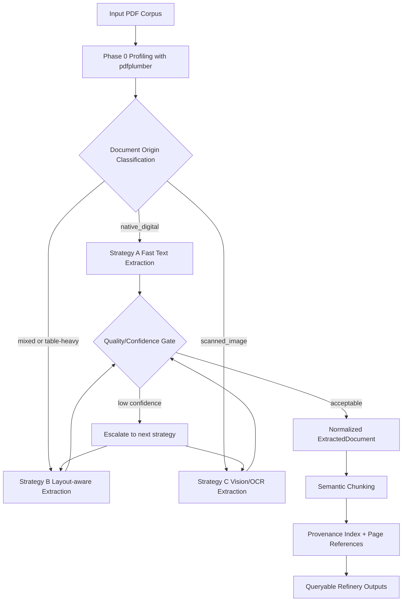

# Domain Notes — Phase 0: Document Science Primer

## 1. Objective and Phase 0 Scope
Phase 0 focuses on domain understanding before implementation: profile document variability, compare extraction behavior, and propose a routing strategy that can later be implemented in triage and extraction agents.

This document is based on generated artifacts from:
- pdfplumber metrics output
- Docling markdown + runtime metrics output
- Manual review goals for the 12-document corpus (minimum 3 per challenge class)

## 2. Evidence Snapshot from Current Outputs
### 2.1 pdfplumber profile evidence
From `.refinery/phase0/pdfplumber/document_summary.csv`:
- Clearly scanned documents show near-zero text stream and full image dominance:
  - `2013-E.C-Assigned-regular-budget-and-expense.pdf`: avg_char_count=0.0, avg_image_area_ratio=1.0, scanned_pages_ratio=1.0
  - `Audit Report - 2023.pdf`: avg_char_count=1.22, avg_image_area_ratio=0.9896, scanned_pages_ratio=0.9895
- Native digital financial/technical documents show high text presence and low scan ratio:
  - `CBE ANNUAL REPORT 2023-24.pdf`: avg_char_count=1984.42, scanned_pages_ratio=0.0621, layout_complexity_guess=table_heavy
  - `fta_performance_survey_final_report_2022.pdf`: avg_char_count=1699.16, scanned_pages_ratio=0.0, layout_complexity_guess=table_heavy
- Mixed-origin documents are visible in the metrics:
  - `Annual_Report_JUNE-2019.pdf`: scanned_pages_ratio=0.5, origin_type_guess=mixed
  - `EthSwitch-10th-Annual-Report-202324.pdf`: scanned_pages_ratio=0.4125, origin_type_guess=mixed

### 2.2 Docling behavior evidence
From `.refinery/phase0/docling/docling_metrics.jsonl` and terminal runs:
- Successful conversions exist for a subset, e.g.:
  - `Annual_Report_JUNE-2023.pdf`: 1247.74s, markdown_chars=448466, table_line_count=713
  - `Annual_Report_JUNE-2020.pdf`: 434.32s, markdown_chars=250672, table_line_count=618
  - `2020_Audited_Financial_Statement_Report.pdf`: 57.33s, markdown_chars=14233, table_line_count=94
- Operational failure observed repeatedly on full runs:
  - RapidOCR warnings: “The text detection result is empty”
  - Repeated “RapidOCR returned empty result!”
  - Process termination with “Killed” (exit code 137), indicating memory/resource pressure during long OCR-heavy runs

## 3. Extraction Strategy Decision Tree (Phase 0 Draft)
Use cheap profiling first, then escalate only when needed.

1) Profile each document/pages using pdfplumber:
- char_count, char_density
- image_area_ratio
- whitespace_ratio
- scanned_likely page flag

2) Aggregate to document-level origin:
- If scanned_pages_ratio >= 0.85 -> `scanned_image`
- Else if native-like pages dominate (scanned low and text present) -> `native_digital`
- Else -> `mixed`

3) Route extraction path:
- `native_digital` + non-complex layout -> Strategy A (fast text extraction)
- `native_digital` + table-heavy OR `mixed` -> Strategy B (layout-aware extraction)
- `scanned_image` -> Strategy C (vision/OCR extraction)

4) Confidence gate after extraction:
- If table fidelity low, reading order broken, or extracted content sparse -> escalate A->B or B->C

5) Operational guardrails for OCR-heavy path:
- Use batch processing + resume
- Restart converter periodically to reduce memory growth
- Treat repeated empty OCR warnings as low-confidence signals

## 4. Failure Modes Observed Across Document Types
### Class A — Annual Financial Report (native digital)
- Multi-column reading order drift in narrative sections
- Footnote and cross-reference detachment around statements
- High table density increases header/row alignment risk
- Very large files increase runtime and parser instability risk

### Class B — Scanned Government/Legal (image-based)
- No usable character stream in many files; OCR is mandatory
- RapidOCR frequently returns empty detections on difficult pages
- OCR-heavy runs are slow and vulnerable to process kill (exit 137)
- Low/OCR-empty pages create sparse output and confidence drops

### Class C — Technical Assessment Report (mixed narrative + findings)
- Mixed narrative/table structure causes section flattening risk
- Findings lists and table boundaries may merge incorrectly
- Structured headings can degrade during extraction and markdown conversion

### Class D — Structured Data / table-heavy reports
- Table fidelity is primary risk (row merges, column drift, split headers)
- Numeric precision risk (misread decimals/separators/signs)
- Large fiscal tables require stronger layout-aware handling than plain text extraction

### Cross-cutting failure patterns aligned to challenge framing
- Structure collapse: broken reading order/table structures
- Context poverty: section/table semantics lost in plain text extraction
- Provenance blindness risk: without stable page/region anchors, auditability degrades

## 5. Pipeline Diagram (Mermaid)

## 6. Phase 0 Conclusion
The corpus confirms a single extraction path is insufficient. A profile-first, escalation-aware routing policy is necessary:
- Native digital documents can start fast, but table-heavy sections require layout-aware extraction.
- Scanned/image-heavy documents require OCR/vision and operational safeguards.
- Repeated RapidOCR empty detections and process kills indicate that OCR path must be treated as expensive/fragile and executed in controlled batches.

This Phase 0 output is ready to drive Phase 1 triage and routing implementation.
