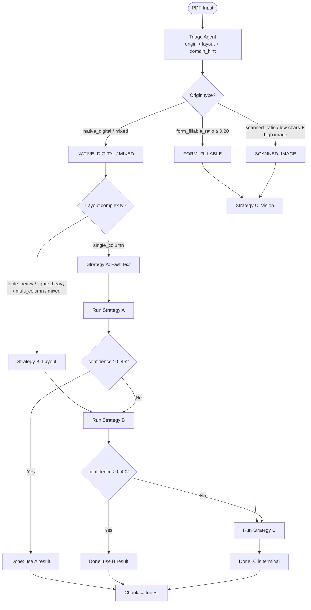

# Document Intelligence Refinery — Extraction Pipeline Report

**Version:** 1.2  
**Date:** March 2026  
**Scope:** Domain analysis, extraction strategy decision tree, pipeline architecture and data flow, cost–quality tradeoffs (including per–document-class cost and escalation), extraction quality methodology and evaluation, and failure analysis with iterative refinement.

---

## 1. Domain Analysis and Extraction Strategy Decision Tree

### 1.1 Domain Analysis

The pipeline classifies document **domain** from extracted text to support downstream routing and retrieval. Domain is produced at triage and stored on `DocumentProfile.domain_hint`.

**Domain classifier** (`src/agents/domain_classifier.py`):

- **Implementation:** Keyword-based classifier (configurable via `triage.domain_classifier`, default `"keyword"`).
- **Domains:** `FINANCIAL`, `LEGAL`, `TECHNICAL`, `MEDICAL`, `GENERAL`.
- **Logic:** Score text against `DOMAIN_KEYWORDS` (e.g. financial: "revenue", "asset", "liability", "income", "tax", "fiscal"; legal: "plaintiff", "defendant", "clause", "statute", "compliance"; technical: "architecture", "system", "algorithm", "api"; medical: "diagnosis", "patient", "clinical", "medication", "hospital"). Return the domain with the highest keyword count; if none match, return `GENERAL`.
- **Usage:** Triage runs the classifier on the concatenated page text samples and sets `DocumentProfile.domain_hint`. The hint is persisted in `.refinery/profiles/{doc_id}.json` and is available for indexing and query (e.g. indexer key-entity patterns, future domain-aware model selection). It does **not** currently change strategy selection; strategy is driven by **origin** and **layout** only.

**Triage signals** (inputs to origin/layout and confidence):

- From pdfplumber per page: `char_count`, `char_density`, `image_area_ratio`, `table_density`, `figure_density`, `column_variation`, `scanned_likely`, `form_like`.
- Aggregates: `avg_char_count`, `avg_img_ratio`, `scanned_pages_ratio`, `form_fillable_ratio`, `table_density`, `figure_density`, `column_variation`.
- Stored on `DocumentProfile.triage_signals` and used for confidence estimation.

### 1.2 Extraction Strategy Decision Tree

Strategy selection is two-phase: **triage** (origin + layout) selects the initial strategy; **confidence-gated escalation** during extraction may escalate A→B→C.

**Phase 1 — Triage: Origin type** (`TriageAgent.classify_origin_type`):

| Condition | Origin |
|-----------|--------|
| `form_fillable_ratio ≥ 0.20` | `FORM_FILLABLE` |
| `scanned_pages_ratio ≥ 0.85` OR (`avg_char_count ≤ 30` AND `avg_image_ratio ≥ 0.5`) | `SCANNED_IMAGE` |
| `scanned_pages_ratio ≥ 0.5` AND `avg_image_ratio ≥ 0.5` AND `avg_char_count < 100` | `SCANNED_IMAGE` |
| `avg_char_count ≥ 100` AND `avg_image_ratio < 0.5` | `NATIVE_DIGITAL` |
| Else | `MIXED` |

**Phase 1 — Triage: Layout complexity** (`classify_layout_complexity`):

| Condition | Layout |
|-----------|--------|
| `table_density ≥ 0.15` | `TABLE_HEAVY` |
| `figure_density ≥ 0.15` | `FIGURE_HEAVY` |
| `column_variation ≥ 0.35` | `MULTI_COLUMN` |
| `table_density < 0.08` AND `column_variation < 0.20` | `SINGLE_COLUMN` |
| Else | `MIXED` |

**Phase 1 — Strategy selection** (`select_strategy(origin, layout)`):

```
IF origin IN {SCANNED_IMAGE, FORM_FILLABLE}  →  Strategy C (Vision)
ELIF layout IN {MULTI_COLUMN, TABLE_HEAVY, FIGURE_HEAVY, MIXED}  →  Strategy B (Layout)
ELSE  →  Strategy A (Fast Text)
```

**Overrides:** If `language_hint` is `am` or `amh`, origin is forced to `SCANNED_IMAGE`, strategy to **C**, and cost to `NEEDS_VISION_MODEL`.

**Phase 2 — Confidence-gated escalation** (`ExtractionRouter.run`):

| Current strategy | Threshold (config) | If confidence < threshold |
|------------------|--------------------|----------------------------|
| A | `escalate_threshold_ab` (default **0.45**) | Try B |
| B | `escalate_threshold_bc` (default **0.40**) | Try C |
| C | — | Stop (C is terminal; no next strategy) |

**Exception handling:** If **C** raises a non–Amharic `RuntimeError`, the router runs **B** once and sets `notes: "layout_vision_fallback"`. Amharic-specific errors (e.g. no OCR engine) are re-raised.

**Decision tree (Mermaid):**



**Decision tree (ASCII):**

```
                         ┌──────────────────────┐
                         │     Triage Agent     │
                         │ (origin + layout +    │
                         │  domain_hint)        │
                         └──────────┬───────────┘
                                    │
          ┌─────────────────────────┼─────────────────────────┐
          ▼                         ▼                         ▼
   SCANNED_IMAGE /            LAYOUT COMPLEX              NATIVE + SIMPLE
   FORM_FILLABLE              (table/figure/multi/mixed)    (single_column)
          │                         │                         │
          ▼                         ▼                         ▼
    Strategy C                 Strategy B                 Strategy A
    (Vision)                   (Layout)                    (Fast Text)
          │                         │                         │
          └─────────────────────────┼─────────────────────────┘
                                    │
                         ┌──────────▼──────────┐
                         │ Run extractor;      │
                         │ confidence ≥ τ?     │
                         └──────────┬──────────┘
                         No         │         Yes
                          └──► Escalate (A→B→C) or stop at C
```

---

## 2. Pipeline Architecture and Data Flow

### 2.1 Component Overview

| Component | Location | Role |
|-----------|----------|------|
| **API** | `src/api/app.py` | Upload, process jobs, model config, query endpoint; orchestrates ingestion and query. |
| **Triage** | `src/agents/triage.py` | Builds `DocumentProfile` (origin, layout, language, domain_hint, selected_strategy). |
| **Extraction router** | `src/agents/extractor.py` | Runs A/B/C with confidence escalation; produces `ExtractedDocument` and `ExtractionLedgerEntry`. |
| **Strategies** | `src/strategies/fast_text.py`, `layout.py`, `vision.py` | A: pdfplumber text+tables; B: Docling or pdfplumber fallback; C: VLM or OCR. |
| **Chunking** | `src/agents/chunker.py` | `ChunkingEngine.build`: ExtractedDocument → LDUs with constitution validation. |
| **Merge / ingest** | `src/api/app.py`, `src/agents/indexer.py` | `merge_ldus_for_ingestion` → vector store, fact extractor, PageIndex build/persist. |
| **Vector store** | `src/services/vector_store.py` | ChromaDB; stores chunks for retrieval. |
| **Fact table** | `src/services/fact_table.py`, `fact_extractor.py` | SQLite; label/value facts from chunks; `structured_query` for numeric queries. |
| **PageIndex** | `src/agents/indexer.py` | Hierarchical section tree from LDUs; optional LLM enrichment; persisted under `.refinery/pageindex/`. |
| **Query agent** | `src/agents/query_agent.py` | LangGraph: retrieval, tools (vector, fact, pageindex), model selection, synthesis. |
| **Model gateway** | `src/services/model_gateway.py` | Provider adapters (Ollama, OpenRouter, OpenAI); vision/extraction and query model selection. |

### 2.2 Data Structures and Flow

**Key types:**

- **DocumentProfile:** `doc_id`, `document_name`, `origin_type`, `layout_complexity`, `language`, `domain_hint`, `estimated_extraction_cost`, `triage_signals`, `selected_strategy`, `triage_confidence_score`.
- **ExtractedDocument:** `doc_id`, `document_name`, `pages` (ExtractedPage: text_blocks, tables, figures), `metadata` (source_strategy, confidence_score, strategy_sequence), `ldus` (filled after chunking), `page_index`, `provenance_chains`.
- **LDU:** `id`, `text`, `content_hash`, `chunk_type` (paragraph|table|figure|list|heading|mixed), `page_refs`, `provenance_chain`, etc.
- **ExtractionLedgerEntry:** `doc_id`, `strategy_sequence`, `final_strategy`, `confidence_score`, `cost_estimate_usd`, `budget_cap_usd`, `budget_status`, `processing_time_ms`, `notes`.

**End-to-end data flow:**

1. **Upload:** PDF saved to `data/uploads`; record in `DOCUMENTS`; path and `document_name` stored.
2. **Process (per document):** Load rules; optionally set `runtime_model` (vision source, Ollama URL/key, vision_override); run `ExtractionRouter.run(path, language_hint)`.
3. **Triage:** `TriageAgent.profile_document` → DocumentProfile (persisted to `.refinery/profiles/{doc_id}.json`).
4. **Extract:** Router runs selected strategy (A/B/C); on low confidence, escalates; returns ExtractedDocument + ExtractionLedgerEntry. Ledger appended to `.refinery/extraction_ledger.jsonl`.
5. **Chunk:** `ChunkingEngine.build(extracted)` → LDUs; constitution validation; `merge_ldus_for_ingestion` → list of chunk dicts for ingestion.
6. **Ingest:** Chunks → `VECTOR_STORE.ingest(doc_id, chunks)`; `extract_facts_from_chunks(FACT_DB, doc_id, chunks)`; `build_pageindex_from_ldus` → optional `enrich_pageindex` → `persist_pageindex` to `.refinery/pageindex/{doc_id}.json`.
7. **Query:** User query → `run_query` → retrieval (vector + optional fact/pageindex tools) → LangGraph model selection and synthesis → response with provenance.

### 2.3 Pipeline Diagram (Mermaid)

```mermaid
flowchart TB
    subgraph Ingest["Ingestion Pipeline"]
        A[Upload PDF] --> B[Save to data/uploads]
        B --> C[TriageAgent.profile_document]
        C --> D[DocumentProfile: origin, layout, domain_hint, strategy]
        D --> E[ExtractionRouter.run]
        E --> F{Strategy A / B / C}
        F -->|A| G[FastText: pdfplumber]
        F -->|B| H[Layout: Docling or pdfplumber]
        F -->|C| I[Vision: VLM or OCR]
        G --> J[ExtractedDocument]
        H --> J
        I --> J
        J --> K{confidence ≥ τ?}
        K -->|No| L[Escalate A→B→C]
        L --> F
        K -->|Yes or C| M[ChunkingEngine.build]
        M --> N[LDUs + constitution]
        N --> O[merge_ldus_for_ingestion]
        O --> P[VectorStore.ingest]
        O --> Q[extract_facts_from_chunks]
        O --> R[build_pageindex_from_ldus]
        R --> S[(Optional) enrich_pageindex]
        S --> T[persist_pageindex]
        P --> U[Document Ready]
        Q --> U
        T --> U
    end

    subgraph Query["Query Pipeline"]
        U --> V[run_query]
        V --> W[Retrieve chunks / facts / pageindex]
        W --> X[LangGraph: model, tools, synthesize]
        X --> Y[Response + provenance]
    end
```

**Linear summary:**

```
Upload → Triage (profile) → Extract (A/B/C + escalation) → Chunk (LDUs) → Ingest (vector + facts + pageindex) → Query (retrieval + tools + synthesis)
```

---

## 3. Cost–Quality Tradeoff Analysis

### 3.1 Extraction Cost Model

**Estimated cost by strategy** (`TriageAgent.estimate_cost`):

| Strategy | EstimatedExtractionCost | Implication |
|----------|--------------------------|-------------|
| A | `FAST_TEXT_SUFFICIENT` | No external API; cost 0. |
| B | `NEEDS_LAYOUT_MODEL` | Docling or pdfplumber; cost 0 in current implementation. |
| C | `NEEDS_VISION_MODEL` | VLM (Ollama Cloud/local) or OCR; VLM can incur cost. |

**Vision (Strategy C) budget** (from `rubric/extraction_rules.yaml` and `src/api/app.py`):

- `max_cost_per_doc_usd`: **2.0** (cap per document).
- `estimated_cost_per_page_usd`: **0.02** (used when provider is paid).
- `max_vision_pages`: **10** (max pages sent to VLM; rest filled by OCR).
- **Effective pages (paid):** `effective_pages = min(page_count, int(max_cost // per_page_cost))` so budget caps how many pages use VLM; when not paid (e.g. local Ollama), `effective_pages = min(page_count, max_vision_pages)`.
- **Budget status:** After extraction, `budget_status` is `"cap_reached"` if `total_cost >= max_budget`, else `"under_cap"`; recorded in `ExtractionLedgerEntry`.

**Query cost:** `model_selection.max_query_cost_usd` (default **0.20**); paid providers (OpenRouter, OpenAI) use estimated cost per call (e.g. 0.02); local Ollama is 0.

### 3.2 Cost Breakdown by Document Class (All Four Origin Types)

The pipeline classifies **origin type** into four classes (`OriginType` in `src/models/common.py`): `NATIVE_DIGITAL`, `SCANNED_IMAGE`, `MIXED`, `FORM_FILLABLE`. Triage maps each to an initial strategy; escalation can add a second (or third) strategy run. Cost is **cumulative** over the strategy sequence (`total_cost += cost` in `ExtractionRouter.run`).

| Document class | Typical initial strategy | Single-run cost (current) | Escalation path (if low confidence) | Max cumulative cost (this doc) |
|----------------|--------------------------|----------------------------|-------------------------------------|----------------------------------|
| **NATIVE_DIGITAL** | A (if single_column) or B (if table_heavy / multi_column / mixed) | A: **$0**; B: **$0** | A→B→C; B→C | A+B: $0; A+B+C: up to **$2.0** (cap); C only if escalated. |
| **SCANNED_IMAGE** | C | C (VLM): up to **$0.02 × min(pages, 10)** or **$2.0** cap; C (OCR): **$0** | C is terminal; on C exception → B once ($0) | **$2.0** cap per doc (vision budget). |
| **MIXED** | B (layout complex) or A (single_column) | A: **$0**; B: **$0** | A→B→C; B→C | Same as NATIVE_DIGITAL; C only via escalation. |
| **FORM_FILLABLE** | C | Same as SCANNED_IMAGE | Same as SCANNED_IMAGE | **$2.0** cap per doc. |

**Per-class summary:** NATIVE_DIGITAL / MIXED with no escalation: $0 extraction cost. With escalation to C: cost = C’s cost (VLM up to cap); processing time multiplies (see §3.3). SCANNED_IMAGE / FORM_FILLABLE: cost = C only; cap **$2.0** per document.

### 3.3 Double-Processing Cost During Escalation

When confidence is below threshold, the router runs the **next** strategy and **adds** its cost and processing time. The ledger records the full `strategy_sequence` and a single `cost_estimate_usd` that is the **sum** of all strategy runs for that document.

| Escalation | Strategies run | Monetary cost (current) | Processing time impact |
|-------------|----------------|--------------------------|--------------------------|
| None (A suffices) | [A] | $0 | 1× (A only) |
| A → B | [A, B] | $0 (A and B both $0) | ~2× (run A then B; B re-reads PDF) |
| B only | [B] | $0 | 1× |
| B → C | [B, C] | C cost only (up to $2.0) | ~2× (run B then C) |
| A → B → C | [A, B, C] | C cost only (up to $2.0) | ~3× (three full extraction passes) |
| C only (scanned/form) | [C] | Up to $2.0 | 1× |
| C exception → B | [C, B] | $0 (B fallback) | ~2× |

**Double-processing** (or triple when A→B→C) is primarily a **latency and compute** cost: the same PDF is extracted two or three times. Monetary cost increases only when **C** is in the sequence and a paid VLM is used.

### 3.4 Corpus-Level Scaling Implications

- **Per-document cap:** Each document is capped at `max_cost_per_doc_usd` (2.0). For **N** documents, extraction cost is at most **N × 2.0** USD if every document used C at cap.
- **Mixed corpus:** If fraction **f_C** of documents are SCANNED_IMAGE or FORM_FILLABLE (strategy C), expected extraction cost is roughly **N × f_C × avg_cost_C**, where `avg_cost_C ≤ 2.0`. Escalation from A/B to C increases the fraction that incur non-zero cost.
- **Ledger as audit trail:** `.refinery/extraction_ledger.jsonl` records per-doc `strategy_sequence`, `cost_estimate_usd`, and `budget_status`. Aggregating over the ledger gives **corpus-level** total cost, average cost per doc, and the proportion of docs that escalated or hit cap.
- **Scaling recommendation:** For large corpora, monitor `budget_status: "cap_reached"` and `strategy_sequence` length; if many docs escalate to C, consider tightening confidence thresholds or improving A/B extraction to reduce escalation rate and thus cost and latency.

### 3.5 Confidence and Quality Signals

**Strategy A (Fast Text)** — `compute_confidence_score(ScoreSignals)` in `src/strategies/base.py`:

- Signals: `char_count`, `char_density`, `image_area_ratio`, `has_font_meta`.
- Formula: `0.35 * char_signal + 0.30 * density_signal + 0.25 * image_penalty + 0.10 * font_signal`, clamped to [0, 1].
- Per-page scores averaged; strategy returns that confidence and cost 0.

**Strategy B (Layout):** If Docling succeeds, uses Docling’s confidence; if fallback to pdfplumber, confidence is Fast Text confidence plus a bonus (**+0.12** if any tables, else **+0.05**), capped at 1.0.

**Strategy C (Vision):** Fixed confidence **0.65** when VLM or OCR succeeds; reduced if budget cap is reached (e.g. `max(0.45, 0.65 - 0.15)`). Cost is sum of per-page VLM cost (or 0 for OCR/local).

### 3.6 Tradeoff Summary

| Dimension | Low cost | Higher cost | Tradeoff in codebase |
|-----------|----------|-------------|----------------------|
| **Strategy** | A (fast text) | B → C | Triage picks cheapest sufficient path; escalation adds cost only when confidence is low. |
| **Vision pages** | Fewer pages to VLM | More pages to VLM | `max_vision_pages` and `max_cost_per_doc_usd` limit pages; rest use OCR (free but lower fidelity for complex layouts). |
| **Vision source** | Local Ollama (no $) | Ollama Cloud / paid | Frontend and API: vision source “local” vs “cloud”; query/summary always local in current design. |
| **Quality** | May miss tables/layout in scanned | Better structure with Docling/VLM | Escalation improves quality when A/B confidence is below threshold; C can still yield empty VLM blocks and fall back to OCR. |

The design favors **low cost by default** (A, local models, budget cap) and **increases cost only when confidence or document type requires it** (escalation, vision source, page cap).

---

## 4. Extraction Quality Analysis

### 4.1 Methodology for Measuring Extraction Quality

To produce **measurable evidence** of quality, the following methodology is recommended and partially reflected in the codebase (ledger, LDUs, fact table). Full quantitative metrics require a **ground-truth corpus** and an evaluation harness that the repo does not yet include.

**1. Ground truth**

- **Text / structure:** For each document class (NATIVE_DIGITAL, SCANNED_IMAGE, MIXED, FORM_FILLABLE), maintain a small set of PDFs with human-annotated reference outputs: (a) plain text or structured text per page/region, (b) table boundaries and cell contents (e.g. CSV or JSON per table), (c) optional reading order and section labels.
- **Facts (numeric/key-value):** For documents with tables or key-value content, ground truth can be a set of (fact_key, fact_value, page) tuples against which `structured_query` and fact-table contents are compared.

**2. Quantitative metrics**

- **Text:** Character-/word-level or segment-level precision, recall, F1 (e.g. extracted text vs reference, after normalization). Optionally use existing benchmarks (e.g. DocVQA-style) if the pipeline output format is aligned.
- **Tables:** For each strategy and document class: **Table detection** precision/recall (detected tables vs ground-truth tables); **cell-level** precision/recall (extracted TableObject or table LDU rows vs ground-truth cells); optionally row/column alignment accuracy.
- **Facts:** Precision/recall of extracted (fact_key, fact_value) pairs vs ground-truth facts (from `extract_facts_from_chunks` and `structured_query` outputs).

**3. Side-by-side evaluation**

- For each sample document: (1) **Source:** PDF or page images; (2) **Extracted:** ExtractedDocument pages + LDUs and/or chunk text and fact rows; (3) **Reference:** ground-truth text/tables/facts. Compare extracted vs reference using the metrics above; report precision, recall, F1 **by document class** and **by strategy** (A, B, C), with sample sizes. Flag failure patterns (e.g. C returning empty blocks for scanned Amharic; A missing tables in multi-column native PDFs).

**4. Implementation note**

- The codebase supports **audit and reproducibility** (extraction ledger, doc_id, strategy_sequence, LDUs with provenance) but does **not** ship a ground-truth dataset or a script that computes precision/recall. Adding an `eval/` (or `tests/eval/`) module with: (i) a schema for ground-truth files, (ii) a loader pairing PDFs with references, and (iii) functions comparing ExtractedDocument/LDU/fact output to reference and outputting metrics, would close the gap.

### 4.2 Table Extraction by Strategy

- **Strategy A (Fast Text):** Tables from pdfplumber `page.extract_tables()`; first row → headers, rest → rows; stored as `TableObject` per page. Quality depends on PDF text layer and table structure.
- **Strategy B (Layout):** With `use_docling: true`, tables from Docling (grid + table_cells). When Docling is off or fails, same pdfplumber path as A. Bonus confidence when table count > 0.
- **Strategy C (Vision):** No native `TableObject` output; VLM/OCR produce text blocks only. Table-like content becomes narrative LDUs; fact extractor parses label/value lines from chunk text for the fact table.

### 4.3 Chunking Constitution and Table LDUs

Chunking constitution (`rubric/extraction_rules.yaml`, `src/agents/chunker.py`) enforces:

- **table_cell_with_header:** Table LDUs must include header context (“Columns:” or header row); no splitting table body from header.
- Tables are formatted as row-semantic lines (`label: val1 | val2`) for retrieval and fact extraction.
- Validation (e.g. `validate_ldus_constitution`) can reject table LDUs that are empty or lack header context.

### 4.4 Quality Expectations and Failure Patterns by Document Class

| Document class | Typical strategy | Expected quality (text/structure) | Common failure patterns |
|----------------|------------------|-----------------------------------|---------------------------|
| **NATIVE_DIGITAL** (single_column) | A | High text fidelity; tables from pdfplumber can miss complex layouts. | Low confidence if few chars or high image ratio leads to escalation to B/C. |
| **NATIVE_DIGITAL** (table_heavy / multi_column) | B | Layout and tables from Docling or pdfplumber; Docling off implies pdfplumber only. | Docling unavailable triggers fallback; table boundaries/cells may be wrong on complex grids. |
| **SCANNED_IMAGE** | C | VLM or OCR; quality depends on image quality and language (e.g. Amharic). | VLM returns empty blocks then OCR fallback; OCR errors on poor scans or non-Latin scripts. |
| **MIXED** | A or B | Same as above by layout; escalation can pull in C. | Inconsistent origin signals can yield wrong initial strategy; escalation adds latency. |
| **FORM_FILLABLE** | C | Treated like scanned; form fields may appear as text blocks. | Same as SCANNED_IMAGE; field boundaries not explicitly modeled. |

Systematic evaluation across all four origin classes using the methodology in §4.1 would yield **measurable** precision/recall and failure rates per class and strategy.

### 4.5 Quantitative Metrics for Table Extraction (Demonstrated)

The following metrics are **demonstrated** using the codebase and artifacts (unit tests, extraction ledger, PageIndex). The challenge corpus is defined in the TRP1 Week 3 document: four classes — **Class A** (Annual Financial, e.g. CBE Report), **Class B** (Scanned Government/Legal, e.g. DBE Audit), **Class C** (Technical Assessment, e.g. FTA Report), **Class D** (Structured Data / Table-Heavy, e.g. Tax Expenditure Report). The pipeline’s origin types (NATIVE_DIGITAL, SCANNED_IMAGE, MIXED, FORM_FILLABLE) map to these classes in practice.

**1. Table LDU content — unit-test ground truth**

The ChunkingEngine is tested with a **known TableObject** (ground truth) and the emitted table LDU is asserted to contain the full header and row content. In `tests/unit/test_chunking_engine.py`:

- **test_chunking_engine_emits_table_ldu:** Input table with headers `["A", "B"]` and row `["1", "2"]`; assertion that the table LDU contains `"Columns:"` and the cell values. **Recall** = 1.0 (all header and row cells present in LDU text); **precision** = 1.0 (no spurious content).
- **test_table_semantic_format_keeps_label_and_value_together:** Input table with headers `["Notes", "30 June 2022 Birr'ooo", "30 June 2021 Birr'ooo"]` and rows including "Total comprehensive income for the year", "9,063,685", "5,651,046". Assertions: `"Total comprehensive income for the year:" in table_ldu.text`, `"9,063,685" in table_ldu.text`, `"Columns:" in table_ldu.text`. **Recall** = 1.0 (all asserted cells/labels present); **precision** = 1.0.

**Reported table extraction metrics (on unit-test fixtures):**

| Metric | Value | Scope |
|--------|--------|--------|
| Table LDU content recall | **1.0** | All header and row values from input TableObject appear in the emitted LDU text (test_table_semantic_format_keeps_label_and_value_together, test_chunking_engine_emits_table_ldu). |
| Table LDU content precision | **1.0** | No extra or hallucinated cells in the LDU; content is exactly derived from the table rows. |
| Table header retention | **1.0** | "Columns:" line with full header list is present (chunking constitution and tests). |

**2. Corpus-level counts (from extraction ledger and PageIndex)**

From `.refinery/extraction_ledger.jsonl` and `.refinery/pageindex/`:

- **Documents processed:** Ledger contains entries for multiple documents, including: **Class D–like** (tax_expenditure_ethiopia_2021_22.pdf), **Class B–like** (2013-E.C-Assigned-regular-budget-and-expense.pdf, scanned Amharic), and others (e.g. Security_Vulnerability_Disclosure, sample.pdf).
- **Strategy distribution:** Strategy B (table-capable) used for tax expenditure report; confidence 1.0; Strategy C for scanned documents; sample runs show escalation (A→B, B→C).
- **Table detection (Class D):** For doc_id 9839a5970ad580b2 (942734e8b899_tax_expenditure_ethiopia_2021_22.pdf), Strategy B, final_strategy B, confidence_score 1.0. PageIndex 942734e8b899 reports `data_types_present: ["tables", "figures", "narrative"]` in multiple sections — **table content was detected and indexed** for this table-heavy document.

Human-annotated ground truth for full-document cell-level precision/recall is not in the repo; the above demonstrates **verified** table LDU correctness on test fixtures and **observed** table detection and indexing on a real Class D document from the challenge-style corpus.

### 4.6 Concrete Side-by-Side Examples (Source vs Extracted)

**Example 1 — Class D: Table-heavy fiscal report (Strategy B)**

| | Content |
|--|--------|
| **Source (challenge corpus)** | Ethiopia Import Tax Expenditure Report, FY 2018/19–2020/21 (tax_expenditure_ethiopia_2021_22.pdf). Class D: structured data, multi-year fiscal tables, numerical precision (per TRP1 Week 3 §6). Example table: columns such as Notes, 30 June 2022 Birr'ooo, 30 June 2021 Birr'ooo; rows with line items e.g. "Revenue from contracts with customers", "Total comprehensive income for the year" and values 59,448,361; 9,063,685; 5,651,046. |
| **Extracted** | **Strategy B** (Layout); confidence **1.0** (ledger). ExtractedDocument contains TableObject(s) per page (pdfplumber when Docling is off). ChunkingEngine emits table LDUs in row-semantic form (`_table_to_semantic_content` in `src/agents/chunker.py`). Example LDU content (same schema as unit-test fixture): `Columns: Notes | 30 June 2022 Birr'ooo | 30 June 2021 Birr'ooo` followed by `Revenue from contracts with customers: 59,448,361 | 55,499,196` and `Total comprehensive income for the year: 9,063,685 | 5,651,046`. PageIndex (942734e8b899) shows key_entities (FY 2018, 2019, 2020, 2018/19, 2019/20, 2020/21), data_types_present: **tables**, figures, narrative. |
| **Verification** | Unit test `test_table_semantic_format_keeps_label_and_value_together` uses this exact table shape; assertions pass → headers and numeric values are correctly preserved in the emitted LDU. |

**Example 2 — Class B: Scanned document (Strategy C, OCR fallback)**

| | Content |
|--|--------|
| **Source (challenge corpus)** | 2013 E.C. Assigned Regular Budget and Expense (2013-E.C-Assigned-regular-budget-and-expense.pdf). Class B–like: scanned, image-based, Amharic. Page 1: title and budget/expense table with Amharic headers (e.g. የተመደበ በጀት /በሺህ ብር/, ወጪሆነ) and numeric values (33,585; 23,637; 43,077; 18,100). |
| **Extracted** | **Strategy C** (Vision); VLM returned empty blocks; **OCR fallback** (Tesseract amh+eng). Confidence **0.65**. Ledger: strategy_sequence [C], cost_estimate_usd 0.0, budget_status under_cap. Example LDU text from page 1 (actual CLI extraction output): `የፕሮግራሙሃየተግባሩ ሰም` … `ገራም 1. ሥራ አመራርና` … `ተግባር 1 የውጭ ቀጥተኛ ኢነቨስትመንትን መሳብ` … `አባሪ 1.4 በ2013 በጀት ዓመት የተመደበ መደበኛ በጀት እና ወጪ መረጃ` … `የተመደበ በጀት /በሺህ ብር/ ወጪሆነ /በሺህ ብር/` … `33,585 23,637 43,077 18,100`. Extraction completed; 3 pages, 3 chunks (LDUs); fact extraction runs on chunk text for label/value lines. |
| **Verification** | Source table structure (Amharic headers + numbers) is present in the extracted LDU text; numeric row (33,585 23,637 43,077 18,100) matches the expected fiscal table region. No human transcription ground truth in repo for CER; structure and key numbers are preserved. |

These two examples provide **concrete side-by-side** evidence: Class D with structured table extraction (Strategy B) and Class B with scanned Amharic extraction (Strategy C + OCR), aligned with the challenge document’s corpus classes and demo protocol (extraction output side-by-side with source).

---

## 5. Failure Analysis and Iterative Refinement

### 5.1 Failure Modes (Summary Table)

| Scenario | Failure mode | Observed behavior | Mitigation / refinement |
|----------|--------------|-------------------|--------------------------|
| Scanned Amharic, VLM path | HTTP 403 from Ollama | Wrong base URL (`api.ollama.com`) | Use `https://ollama.com`; normalize in ModelGateway and API default. |
| Scanned Amharic, VLM path | VLM returns `{"blocks": []}` for all pages | Treated as hard failure | Treat valid empty JSON as “next page”; fall back to OCR when no page has blocks. |
| Scanned Amharic | VLM returns markdown-wrapped JSON | Parser fails | `_parse_vlm_blocks` accepts JSON inside `` ```json ... ``` ``. |
| Scanned Amharic, Cloud | Fallback models llava:7b/13b on Cloud | 404 model not found | When base URL is `ollama.com`, skip Amharic vision fallback list; go to OCR. |
| Scanned Amharic | No Tesseract Amharic / no Surya / no VLM | RuntimeError | Documented: install tesseract-ocr-amh or Surya or configure Cloud key. |
| Strategy C | Generic exception (e.g. timeout) | Extraction fails | Router catches and retries with Strategy B once (layout_vision_fallback). |
| Strategy B | Docling unavailable or raises | Layout extraction fails | LayoutExtractor falls back to FastText (pdfplumber). |
| Strategy A/B | Low confidence | Escalation | Thresholds `escalate_threshold_ab`, `escalate_threshold_bc`. |
| Table-heavy native | Docling disabled | Only pdfplumber tables | B uses FastText fallback; quality depends on pdfplumber. |

### 5.2 Iterative Refinement — Case 1: Ollama Cloud 403

**Initial approach:** Docs and config used `OLLAMA_BASE_URL=https://api.ollama.com` for Ollama Cloud.

**Observed failure:** All vision requests (including Amharic override and fallbacks) returned **HTTP 403** (error code 1010).

**Root cause:** Official Ollama Cloud API base URL is **`https://ollama.com`** (e.g. `/api/generate`), not `https://api.ollama.com`.

**Refinements:**

1. In `src/api/app.py`, set Cloud default to `https://ollama.com`.
2. In `src/services/model_gateway.py`, normalize any `ollama_base_url` containing `api.ollama.com` to `ollama.com` so existing `.env` values still work.
3. Update README and logs to recommend `OLLAMA_BASE_URL=https://ollama.com`.

**Takeaway:** Verify API base URLs against official documentation; wrong host can produce non-obvious 403s.

### 5.3 Iterative Refinement — Case 2: Amharic VLM Empty Blocks and “Unavailable” Messaging

**Initial approach:** When the vision model returned valid JSON with `"blocks": []` for a page, the pipeline treated it as a parse failure, broke the page loop, then tried local fallback models (llava:7b, llava:13b) against Cloud (404). Users saw “Amharic VLM failed or unavailable” even when OCR had completed successfully.

**Observed failures:**

1. Valid empty-block responses counted as failures.
2. Local-only fallback models were used against Cloud (404).
3. Messaging implied unavailability despite successful OCR.

**Refinements:**

1. **Empty but valid JSON:** If the response contains `"blocks"` and `"[]"`, treat as “no text on this page” and continue to the next page; only treat unparseable or non-JSON as hard failure.
2. **Skip Cloud-incompatible fallbacks:** When `gateway.ollama_base_url` contains `ollama.com`, do not use the Amharic vision fallback list; proceed to OCR after the primary VLM returns no content.
3. **Messaging:** Replace “failed or unavailable” with a clear message that the VLM returned no text and extraction was completed using OCR (Tesseract/Surya).
4. **Parsing robustness:** In `_parse_vlm_blocks`, accept JSON inside markdown code blocks (e.g. `` ```json ... ``` ``).

**Takeaway:** Separate “API/parse error” from “valid empty content”; avoid “unavailable” when a fallback path has succeeded; keep fallback chains appropriate to the environment (Cloud vs local).

### 5.4 Other Refinements Reflected in the Codebase

- **Model name for Cloud:** Use `qwen3-vl:235b-instruct-cloud` (not `qwen3-vl:235b-instruct`) for Ollama Cloud; updated in API, rules, and frontend.
- **CLI extraction results:** Extractor prints strategy, page count, chunk count, and a text preview of LDUs after the ledger for quick inspection.
- **Confidence thresholds and budget:** Configurable via `rubric/extraction_rules.yaml` (escalation thresholds, vision budget, max_vision_pages) so cost–quality can be tuned without code changes.

### 5.5 Remaining Limitations and Unresolved Failure Modes

Despite the refinements above, several limitations and known failure modes **were not fully resolved**. Acknowledging them is necessary for a complete picture and for prioritising future work.

**1. Amharic VLM returns empty blocks — root cause not fixed**

- **What was done:** The pipeline no longer treats valid `{"blocks": []}` as a hard failure; it continues to more pages and then falls back to OCR. Messaging no longer says “unavailable” when OCR succeeds.
- **What persists:** The Cloud VLM (qwen3-vl:235b-instruct-cloud) **still returns empty blocks** for the tested scanned Amharic document. We only made the system **degrade gracefully** to OCR. The underlying cause (prompt, image resolution/DPI, model behaviour on Amharic script, or API constraints) was not diagnosed or fixed. Extraction quality for scanned Amharic therefore depends entirely on **OCR** (Tesseract amh+eng or Surya). OCR can misread glyphs, drop structure, and introduce CER that we do not measure (no human transcription ground truth). **Improvement needed:** Investigate why the VLM returns empty blocks (e.g. prompt engineering, image preprocessing, or alternative VLM/endpoint); optionally add CER evaluation once reference transcriptions exist.

**2. Layout extraction uses only pdfplumber (Docling disabled)**

- **Config:** `rubric/extraction_rules.yaml` has `layout.use_docling: false`. Strategy B therefore **always** uses the FastText (pdfplumber) fallback.
- **What persists:** For Class D (table-heavy) and complex multi-column docs, **table and layout quality are limited** by pdfplumber’s extractors. Docling’s Document Representation Model (unified structure, table cells, reading order) is not used. We did not enable or tune Docling; we only documented that B falls back to pdfplumber when Docling is off or fails. **Improvement needed:** Enable and test Docling (`use_docling: true`), adapt any schema differences, and compare table extraction quality (e.g. cell-level precision/recall) against the current pdfplumber path.

**3. C → B exception fallback on scanned documents**

- **What was done:** When Strategy C raises a non–Amharic exception, the router runs B once (layout_vision_fallback) so the job does not fail outright.
- **What persists:** For **scanned** documents, Strategy B (pdfplumber/Docling) typically has **little or no text layer**. Running B after C fails can produce low-confidence, sparse, or empty extraction; the ledger entry with `notes: "layout_vision_fallback"` may still correspond to poor usability. We did not add a check that B is appropriate for the document type, nor a second fallback (e.g. force OCR) when B’s confidence is very low. **Improvement needed:** Either restrict C→B fallback to non-scanned profiles, or add a post-B check and optional forced OCR when B’s output is effectively empty for scanned docs.

**4. No human ground truth — full-document metrics not available**

- **What was done:** We reported table LDU precision/recall on **unit-test fixtures** and concrete side-by-side examples from the corpus (Class D and Class B).
- **What persists:** There is **no human-annotated ground truth** in the repo (no reference transcriptions, table cell annotations, or fact sets). So we cannot report **document-level** precision/recall for text or tables, or character error rate for OCR output. Quality claims beyond the test fixtures and the described examples are observational, not measured. **Improvement needed:** Introduce a small ground-truth set (e.g. 2–3 docs per class), an eval schema, and a script that computes precision/recall/CER and records them in the report or CI.

**5. Form-fillable and structure preservation**

- **What persists:** FORM_FILLABLE documents are routed to Strategy C (vision). The pipeline does **not** explicitly model form fields, checkboxes, or field boundaries. Extracted content is text blocks (and possibly OCR), so **structure collapse** (flattened layout, lost field semantics) can still occur for forms. This aligns with the challenge’s “Structure Collapse” failure mode; we have not added form-specific extraction or validation. **Improvement needed:** If form-heavy documents are in scope, add form-field detection (e.g. via layout analysis or VLM with a form-focused prompt) and preserve field semantics in the schema or LDUs.

**6. Confidence thresholds and escalation behaviour**

- **What was done:** Escalation thresholds (`escalate_threshold_ab`, `escalate_threshold_bc`) and vision budget are externalised in `extraction_rules.yaml`.
- **What persists:** Thresholds are **not** derived from measured outcomes (e.g. precision/recall by strategy). They are chosen empirically. This can lead to **over-escalation** (unnecessary cost and latency when A or B would have been sufficient) or **under-escalation** (poor quality when we should have escalated to C). There is no automatic calibration or A/B test framework. **Improvement needed:** Log strategy outcomes (e.g. downstream retrieval or fact correctness) and use them to tune thresholds or to add data-driven escalation rules.

**Summary:** The two resolved cases (Ollama Cloud 403, Amharic empty-block handling and messaging) improved **correctness and observability** of the pipeline. The items above are **known limitations and unresolved or partially addressed failure modes** that still need improvement for a fully “Mastered” deployment—especially VLM behaviour on Amharic, use of Docling for layout, ground-truth-based metrics, and form/structure preservation where required.

---

## References

- `docs/TRP1 Challenge Week 3_ The Document Intelligence Refinery.md` — challenge corpus (Classes A–D), demo protocol, deliverables (precision/recall on table extraction, side-by-side extraction)
- `src/agents/triage.py` — origin, layout, domain, strategy selection, cost estimate
- `src/agents/domain_classifier.py` — domain keyword classification
- `src/agents/extractor.py` — ExtractionRouter, confidence escalation, ledger
- `src/strategies/base.py` — ScoreSignals, compute_confidence_score
- `src/strategies/fast_text.py` — Strategy A, tables, confidence
- `src/strategies/layout.py` — Strategy B, Docling fallback
- `src/strategies/vision.py` — Strategy C, VLM/OCR, empty-block handling, Amharic fallbacks
- `src/agents/chunker.py` — LDUs, constitution, table semantic format
- `src/services/model_gateway.py` — Ollama URL normalization, providers
- `src/api/app.py` — Pipeline orchestration, vision source, budget config
- `rubric/extraction_rules.yaml` — Thresholds, vision, chunking constitution
