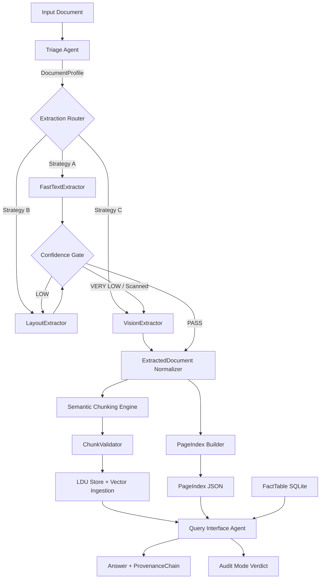

# Technical Design: Document Intelligence Refinery MVP

## 1. Design Goals

- Convert heterogeneous enterprise documents into structured, queryable, provenance-preserving knowledge.
- Prevent low-quality extraction from flowing downstream via confidence-gated escalation.
- Preserve spatial provenance (`page`, `bbox`, `content_hash`) from extraction through answer generation.
- Make onboarding of new document types configuration-driven (`rubric/extraction_rules.yaml`) rather than code-driven.

## 2. System Context

### Inputs
- PDFs (native digital + scanned image + mixed)
- Optional office/image inputs normalized to PDF-compatible processing flow

### Outputs
- Structured JSON schemas (`DocumentProfile`, `ExtractedDocument`, `LDU`, `PageIndex`, `ProvenanceChain`)
- `.refinery/profiles/*.json`
- `.refinery/extraction_ledger.jsonl`
- `.refinery/pageindex/*.json`
- Vector index (ChromaDB or FAISS)
- SQLite fact table for numeric querying

### Deployment Constraints (Local-First)
- No paid cloud object storage is required.
- Artifacts are stored locally under `.refinery/` and repository-controlled paths.
- Vector and structured storage are local (`ChromaDB` or `FAISS`, plus `SQLite`).
- Model execution uses local Ollama by default and OpenRouter as configurable/guarded escalation.

## 3. Five-Stage Pipeline Architecture



## 4. Stage-by-Stage Design

### Stage 1 — Triage Agent

**Responsibilities**
- Build `DocumentProfile` per document.
- Estimate extraction cost tier and strategy suitability.
- Persist profile for traceability and reruns.

**Decision signals**
- Character density by page
- Whitespace ratio and text distribution
- Image area / page area
- Layout cues: column count, table density, figure density
- Language detection + confidence
- Domain keyword scoring (pluggable classifier)

**Output contract**
- `DocumentProfile` JSON at `.refinery/profiles/{doc_id}.json`

**Typical tooling**
- Industry: `pdfplumber`, `PyMuPDF`, lightweight heuristic/layout classifiers.
- Open-source alternatives: `pdfplumber`, `pypdf`, `PyMuPDF`.

### Stage 2 — Multi-Strategy Extraction + Escalation Guard

**Strategies**
- **A FastTextExtractor (low cost)**: pdfplumber / pymupdf
- **B LayoutExtractor (medium cost)**: Docling or MinerU adapter
- **C VisionExtractor (high cost)**: VLM via OpenRouter with budget cap

**Routing rules (high-level)**
- `native_digital + single_column` → Strategy A
- `multi_column | table_heavy | mixed` → Strategy B
- `scanned_image | handwriting | confidence below threshold` → Strategy C

**Escalation guard (mandatory)**
1. Run selected strategy.
2. Compute confidence from multi-signal score.
3. If below threshold:
   - A → retry with B
   - B → retry with C
4. Persist attempt chain in extraction ledger.

**Budget guard (Strategy C)**
- Track cumulative estimated cost per document.
- Stop or skip non-critical pages when cap exceeded.
- Mark result as partial if cap prevents full extraction.

**Typical tooling**
- Industry: `Docling`, `MinerU`, `Marker`, OCR engines, VLM endpoints.
- Open-source alternatives: `Docling`, `MinerU`, `Marker`, `PaddleOCR`, `Tesseract`.

**Multilingual organization in this stage**
- OCR and extraction adapters SHOULD preserve per-block/page language signals when available.
- Low language confidence or script mismatch MUST reduce confidence score and can trigger escalation.

### Stage 3 — Semantic Chunking Engine

**Responsibilities**
- Convert `ExtractedDocument` to `List[LDU]`.
- Enforce chunking constitution rules before emission.

**Hard rules**
1. Table cell never split from header row.
2. Figure caption always attached to parent figure chunk metadata.
3. Numbered list remains one LDU unless max token breach.
4. Section headers propagated to all child chunks.
5. Cross-references resolved and stored as relationships.

**Validation**
- `ChunkValidator` rejects invalid chunks and returns violations.

**Typical tooling**
- Industry: semantic splitters and hierarchical chunking over structured docs.
- Open-source alternatives: LlamaIndex semantic splitting patterns + custom validator rules.

### Stage 4 — PageIndex Builder

**Responsibilities**
- Build hierarchical section tree.
- Add short section summaries and key entities.
- Provide topic-based navigation returning top relevant sections.

**Indexing approach**
- Structural signals: headings, numbering patterns, layout hierarchy
- Entity extraction from section chunks
- Summary generation with low-cost model

**Typical tooling**
- Industry: custom section tree builders with summarization.
- Open-source alternatives: deterministic tree builders + local/low-cost summarization models.

### Stage 5 — Query Interface Agent

**Tools**
- `pageindex_navigate(topic, k=3)`
- `semantic_search(query, filters)`
- `structured_query(sql_or_intent)`

**Answer policy**
- Must attach `ProvenanceChain` for each claim.
- If evidence is missing, answer marked `unverifiable` for that claim.

**Audit mode**
- Input: natural-language claim
- Output: `verified` + citations OR `unverifiable` + reason

**LangGraph/LangSmith placement**
- LangGraph is REQUIRED for this stage to orchestrate tool calls and control flow.
- LangSmith tracing is REQUIRED for this stage to capture model/tool decisions and provenance metadata.
- Earlier stages may use plain deterministic orchestration; tracing there is optional and implementation-dependent.

**Typical tooling**
- Industry: graph-based orchestration, vector retrieval, structured DB querying.
- Open-source alternatives: `LangGraph`, `ChromaDB`/`FAISS`, `SQLite`.

## 5. Data Model Design (Schema-Level)

### 5.1 DocumentProfile

```yaml
doc_id: string
document_name: string
origin_type: native_digital | scanned_image | mixed | form_fillable
layout_complexity: single_column | multi_column | table_heavy | figure_heavy | mixed
language:
  code: string
  confidence: float
domain_hint: financial | legal | technical | medical | general
estimated_extraction_cost: fast_text_sufficient | needs_layout_model | needs_vision_model
triage_signals:
  avg_char_density: float
  avg_whitespace_ratio: float
  avg_image_area_ratio: float
  table_density: float
  figure_density: float
selected_strategy: A | B | C
```

### 5.2 ExtractedDocument (normalized)

```yaml
doc_id: string
document_name: string
pages:
  - page_number: int
    width: float
    height: float
    text_blocks:
      - id: string
        text: string
        bbox: [x0, y0, x1, y1]
        reading_order: int
    tables:
      - id: string
        title: string | null
        headers: [string]
        rows: [[string]]
        bbox: [x0, y0, x1, y1]
    figures:
      - id: string
        caption: string | null
        bbox: [x0, y0, x1, y1]
        references: [string]
metadata:
  source_strategy: A | B | C
  confidence_score: float
```

### 5.3 LDU

```yaml
ldu_id: string
content: string
chunk_type: paragraph | table | figure | list | heading | mixed
page_refs: [int]
bounding_box: [x0, y0, x1, y1] | null
parent_section: string | null
token_count: int
content_hash: string
relationships:
  - type: cross_reference | continuation | caption_of
    target_id: string
```

### 5.4 PageIndex

```yaml
doc_id: string
root:
  section_id: string
  title: string
  page_start: int
  page_end: int
  summary: string
  key_entities: [string]
  data_types_present: [tables | figures | equations | narrative]
  child_sections: [PageIndexNode]
```

### 5.5 ProvenanceChain

```yaml
answer_id: string
citations:
  - document_name: string
    page_number: int
    bbox: [x0, y0, x1, y1]
    content_hash: string
    excerpt: string
verification_status: verified | unverifiable | partial
```

### 5.6 ExtractionLedgerEntry

```yaml
timestamp: string
doc_id: string
document_name: string
strategy_sequence: [A | B | C]
final_strategy: A | B | C
confidence_score: float
cost_estimate_usd: float
processing_time_ms: int
budget_cap_usd: float
budget_status: under_cap | cap_reached
notes: string | null
```

## 6. Key Algorithms and Heuristics

### 6.1 Confidence Score (conceptual)

Weighted score in `[0,1]`:
- Character density quality
- Text extraction completeness
- Table structural completeness
- OCR quality proxy (for scanned)
- Reading order coherence

Low confidence thresholds are externalized in `rubric/extraction_rules.yaml`.

### 6.2 Strategy Selection Matrix

| Origin / Layout | Preferred | Fallback | Final Escalation |
|---|---|---|---|
| native_digital + single_column | A | B | C |
| native_digital + table_heavy/multi_column | B | C | N/A |
| mixed | B | C | N/A |
| scanned_image | C | N/A | N/A |

### 6.3 Cost Control

- Per-document budget cap for Strategy C.
- Optional page-priority ordering (pages with high table density first).
- Partial extraction explicitly marked in artifacts.

### 6.4 Dynamic Model Selection Policy (Context-Dependent)

This policy is implementation-dependent and can vary by deployment goals.

Recommended baseline:
- Prefer local Ollama for low-complexity triage/summarization and low-risk queries.
- Prefer OpenRouter VLM path for scanned/image-heavy pages, weak extraction confidence, or complex structural recovery.
- Allow user override from frontend config panel while recording override metadata.

## 7. Storage and Artifact Layout

```text
.refinery/
├── profiles/
│   └── {doc_id}.json
├── extraction_ledger.jsonl
├── pageindex/
│   └── {doc_id}.json
├── chunks/
│   └── {doc_id}.json
└── facts/
    └── refinery_facts.db
```

## 8. API / Tool Contracts (Specification-Level)

### `pageindex_navigate`
- Input: `{ doc_id, topic, k }`
- Output: top-`k` sections `{section_id, title, page_start, page_end, relevance_score}`

### `semantic_search`
- Input: `{ doc_id, query, top_k, filters }`
- Output: ranked LDU hits with metadata + minimal provenance

### `structured_query`
- Input: `{ doc_id, query_type, sql_or_intent }`
- Output: rows + linked provenance ids

### `audit_claim`
- Input: `{ doc_id, claim }`
- Output: `{status, citations[], reason}`

## 9. Non-Functional Design Constraints

- Fully typed Pydantic schema boundaries between stages.
- Config-driven thresholds and strategy policies in `rubric/extraction_rules.yaml`.
- Stage-level deterministic artifacts for reproducibility.
- Traceability first: every answer can be traced to source coordinates.

## 10. Validation & Demonstration Mapping

The design explicitly supports Demo Protocol sequence:
1. Triage output via `DocumentProfile`
2. Extraction fidelity + ledger evidence
3. PageIndex traversal before semantic search
4. Query answer with provenance and source-page verification

## 11. Risks and Mitigations

- **Risk**: Poor OCR on noisy scans.  
  **Mitigation**: Strategy C escalation + confidence rejection + partial flags.
- **Risk**: Table fragmentation across pages.  
  **Mitigation**: Chunk rule + continuation relationship linking.
- **Risk**: Cost overrun for vision extraction.  
  **Mitigation**: Budget guard and prioritized page processing.
- **Risk**: Hallucinated answers despite retrieval.  
  **Mitigation**: Strict provenance requirement and audit mode fallback.

## 12. Source Notes and References

The following references motivate major architecture/tooling decisions. Exact implementation details can vary by system.

- TRP1 challenge architecture and mandatory stages: `docs/TRP1 Challenge Week 3_ The Document Intelligence Refinery.md`
- Docling (IBM Research): https://github.com/DS4SD/docling
- MinerU (OpenDataLab): https://github.com/opendatalab/MinerU
- Marker: https://github.com/VikParuchuri/marker
- PageIndex concept repository: https://github.com/VectifyAI/PageIndex
- Chunkr repository: https://github.com/lumina-ai-inc/chunkr
- LangGraph docs: https://langchain-ai.github.io/langgraph/
- LangSmith docs: https://docs.smith.langchain.com/
- ChromaDB docs: https://docs.trychroma.com/
- FAISS docs: https://faiss.ai/
- pdfplumber docs: https://github.com/jsvine/pdfplumber
- Tesseract OCR docs: https://tesseract-ocr.github.io/
- PaddleOCR repo: https://github.com/PaddlePaddle/PaddleOCR

Where practices differ across implementations, this design favors cost-aware local-first defaults with confidence-gated escalation.
