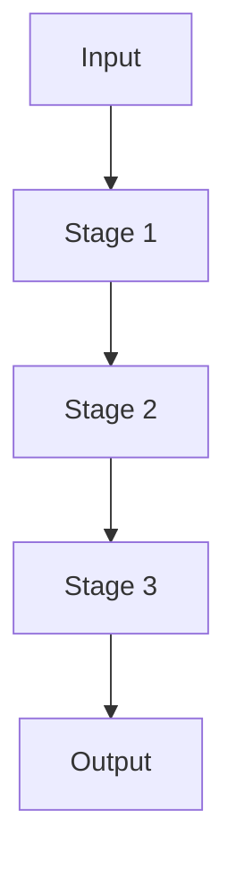

# Technical Design: [FEATURE NAME]

## 1. Design Goals

- [Goal 1]
- [Goal 2]
- [Goal 3]

## 2. System Context

### Inputs
- [Input types]

### Outputs
- [Output artifacts]

## 3. Architecture Overview



## 4. Stage-by-Stage Design

### Stage 1 — [Name]
- **Responsibilities**: [What it does]
- **Inputs**: [Typed contract]
- **Outputs**: [Typed contract]
- **Failure Handling**: [Fallback/escalation]

### Stage 2 — [Name]
- **Responsibilities**: [What it does]
- **Inputs**: [Typed contract]
- **Outputs**: [Typed contract]
- **Failure Handling**: [Fallback/escalation]

### Stage 3 — [Name]
- **Responsibilities**: [What it does]
- **Inputs**: [Typed contract]
- **Outputs**: [Typed contract]
- **Failure Handling**: [Fallback/escalation]

## 5. Data Model Design (Schema-Level)

### 5.1 [PrimaryEntity]

```yaml
id: string
field_a: string
field_b: int
metadata:
  created_at: string
```

### 5.2 [SecondaryEntity]

```yaml
id: string
parent_id: string
payload: object
```

## 6. Decision Logic & Heuristics

- [Decision rule 1]
- [Threshold or scoring approach]
- [Escalation policy]

## 7. Storage and Artifact Layout

```text
.refinery/
├── profiles/
├── extraction_ledger.jsonl
├── pageindex/
└── chunks/
```

## 8. API / Tool Contracts (Specification-Level)

### `[tool_or_endpoint_name]`
- Input: `{ ... }`
- Output: `{ ... }`
- Error cases: `[error_a, error_b]`

## 9. Non-Functional Constraints

- [Performance]
- [Cost]
- [Traceability]

## 10. Validation Mapping

- [How design maps to demo/acceptance criteria]

## 11. Risks and Mitigations

- **Risk**: [Risk]
  **Mitigation**: [Mitigation]
